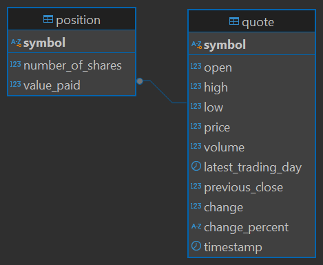

```bash
docker run --rm --name stock-quote -e POSTGRES_PASSWORD=password -d -v $HOME/srv/postgres:/var/lib/postgresql/data -p 5432:5432 postgres
```
```bash 
docker run --rm -it -e ALPHA_VANTAGE_KEY=$env:ALPHA_VANTAGE_KEY ahmedamerworks/jdbc
docker run --rm -it -e ALPHA_VANTAGE_KEY=$ALPHA_VANTAGE_KEY ahmedamerworks/jdbc
```


# Introduction
The purpose of this project was to design and implement a functional Stock Quote app
that allows the user to fetch stock price quotes directly from 
the stock market, buy any number of shares available,
and sell the shares they own. The app was built using Core Java 11 as 
OkHttpClient for sending HTTP requests, Jackson 
Core library for parsing JSON data to Quote and Position objects.

For testing, we used JUNIT5 to write testing methods and Mockito to mock objects during unit testing.
A docker image was built and sent to [Docker hub](https://hub.docker.com/repository/docker/ahmedamerworks/jdbc/general) 
for ease of access and deployment. The app fetches real-time 
stock data from [Alpha Vantage](https://www.alphavantage.co/). The app dependencies, building, and packaging phases were
managed using Maven. The database was created and managed through CLI commands and is a postgresql relational database.

# Implementation
## ER Diagram
This diagram shows us the two tables that should be housed within the database that communicates with
the app. It shows a very basic one-to-one relationship between Quotes and Positions.




## Design Patterns
The app was designed with the principles of Repository Design Patterns in mind. We sought a separation of the app's 
business logic and the components that managed data access and CRUD operations. To handle the communication between the code
and the database we build Data Access Objects for our Quotes and Positions. As well, we created a QuoteHttpHelper class to separate fetching
and parsing the JSON data from the API.

On the surface layer of the app, a minimal UI that uses the command line interface was put in place. The app controller
receives user input and, based on this, invokes either PositionService or QuoteService. Both invoke their respective
DAOs in order to handle the storage, retrieval, deletion, and updating of data from the local PostgresQL database.

## Test
Implementation of the DAOs was tested by writing tests that verify each CRUD operation using JUNIT5. 
Tests for the QuoteHttpHelper were written to ensure the API was working as expected and that the class
threw the appropriate exceptions.

For testing of Service classes (business logic of the app), unit tests as well as integration testing 
were employed. During unit testing, Mockito was used to make mocks and configure the behaviour of any
dependant classes, such as the data access objects. Integration tests simply invoked the services in an
environment where real components of the app were used and the results were verified.

Testing of the controller component of the app was a matter of running the app and simulating each major 
and minor use case. User acceptance testing was somewhat employed at this stage, where a few, non-developer
background potential users of the app would navigate the UI and attempt to trade stock.

# Starting the App
Obtain the docker image by running this command in the shell:
```bash
docker pull ahmedamerworks/jdbc
```
Before attempting to deploy the app it is important to note a few things:
- The app requires a database to be currently running locally
- You should edit the properties.txt file to house the database name, username, password of your own
  local postgresQL db before you attempt to run the app
- The app requires an ENV variable that stores a free Alpha Vantage API key
    and it should be passed as ```"ALPHA_VANTAGE_KEY"```
- You can obtain a free key [here](https://www.alphavantage.co/support/#api-key)

Run the app through a docker container using this line:
```bash
docker run --rm -it -e ALPHA_VANTAGE_KEY=$ALPHA_VANTAGE_KEY ahmedamerworks/jdbc
```

## Common issues

- The app was built to be run from a docker image, so the relative paths within the code point to 
    directories inside the image. Should the app ever need to run locally from the JAR or in an IDE, the
    relative paths would need to change back.
- Always ensure a valid API key is being passed as an ENV variable, otherwise an error will be thrown.
- A free API key from Alpha Vantage has a limit of 5 API calls per minute. The app will inform the user
    whenever this limit is reached.

## Potential Improvements

In the future, the app should be able to allow users to sell positions in a more fine manner and not just
sell every share available. As well, the app could do with a better frontend, such as could be built with
React.js