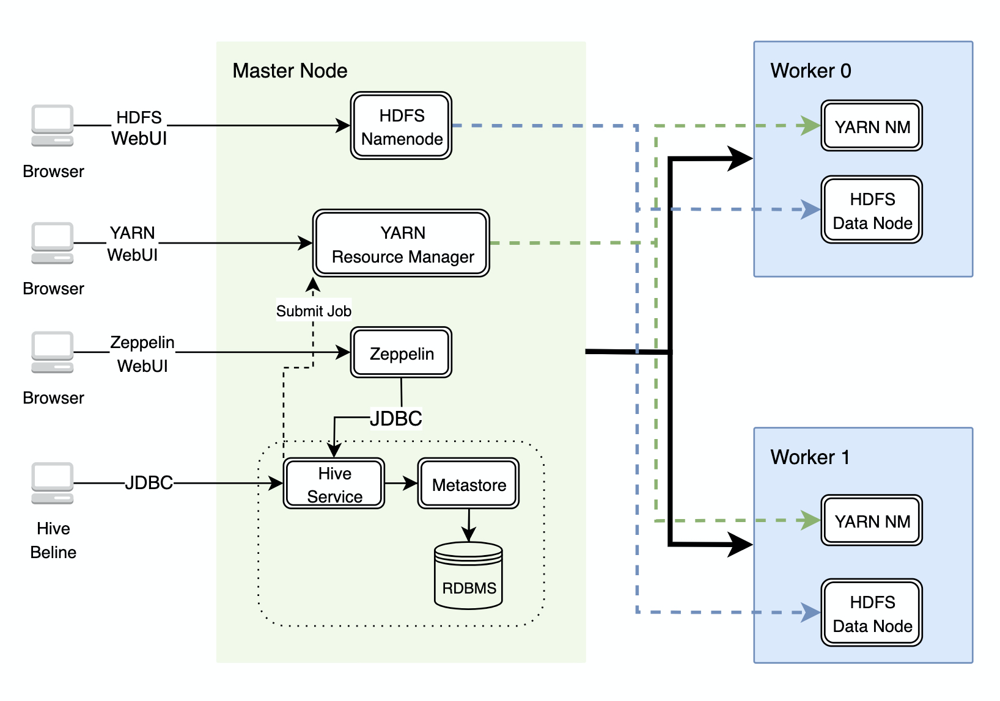
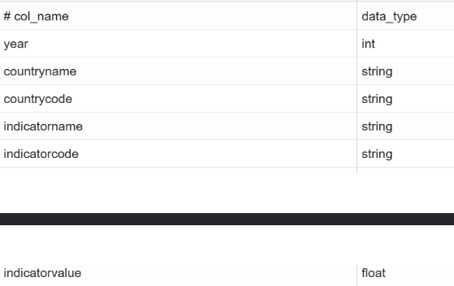
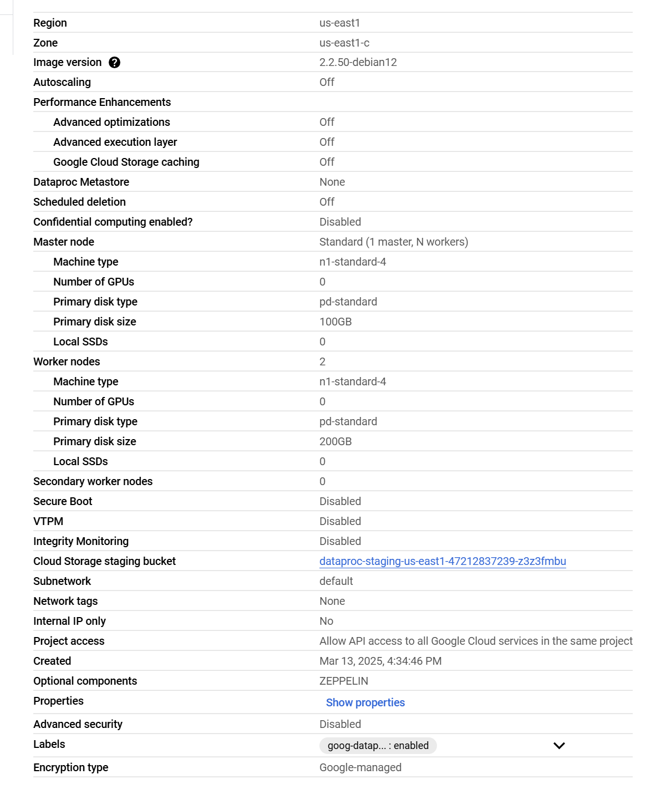

# Hadoop Project

## Table of contents

* [Introduction](#introduction)
* [Hadoop Cluster](#hadoop-cluster)
* [Hadoop Cluster Specs](#hadoop-cluster-specs)
* [Hive Project](#hive-project)
* [Improvements](#improvements)

## Introduction

After completing the PoC for the Java trading app, our team was assigned the task of evaluating the potential to harness a Hadooop cluster for processing big data. We were tasked with leveraging a cluster through Google Cloud Platform and evaluating the process times of several jobs that aimed to solve business questions using the openly available WDI data from 2016. I will be discussing details about the findings of the project, the core components of Hadoop, and its strengths and weaknesses.

## Hadoop Cluster

We provisioned a Hadoop cluster through the Google Cloud Platform. We had one Master Node and two Worker Nodes. The specifications for the machines are listed [below](#hadoop-cluster-specs)!  

For writing our code, we used a Zeppelin Notebook (screenshotted below). The WDI 2016 data was first captured on the Google Cloud Storage platform and inserted into External HiveQL tables that sat within the Hadoop Distributed File System. The HDFS is managed by the namenode which leverages worker nodes 0 and 1 to distribute the data in blocks across the storage system. GCP allows us to view a webUI of the namenode and all the metadata stored within it.  

YARN is our resource manager and leverages the worker nodes based on what is needed for each job we send it. It communicates with worker nodes via their YARN NodeManagers. We used Hive queries on the Zeppelin notebook for most of our jobs, in some cases we used the Hive Beeline CLI to run queries or view a list of HiveQL tables (metadata for tables and things like partitions of tables is stored within the Hive Metastore).  

WDI Data 2016: data from the world bank on various developmental indicators of all countries in the world (around 1.8GB). The schema is screenshotted below.  

## Hive Project

You can find a screenshot of our Zeppelin Notebook here: [Hive Project Screenshot](notebook.pdf)  

Throughout the project we evaluated different big data tools and their performance times.

* Querying tables that sit on the HDFS rather than cloud storage:  
  When we migrate the data to a table that is stored within the HDFS we see a significant boost in query performance. We can say that this is due to data locality (minimizes data transfers over networks) but also due to Hadoop's optimization for MapReduce jobs.

* Comparing Hive vs Bash scripts:  
  When we wrote and executed a bash script that carries out the same computation as one of our queries (count of all rows), we saw that the step of retrieving the data from HDFS caused a lot of overhead. In this way, we can say that the integration of HiveQL with Hadoop's environment and components offers a lot of benefits, including opmtimization of data retrieval and processing.

* Partitioned Tables:  
  In order to optimize queries (Canadian GDP Growth in 2015), we explored using partitioned tables. We partitioned the same data by the column 'year', following the use of a different SerDe that parsed the data as intended. We saw a staggering difference in performance as the data was partitioned by year so only the data pertaining to the year '2015' was read by Hive. Partitioning also supports organizing the data in HDFS and scalability.

* Columnar File Format:  
  In storing the data in Parquet format rather than simple textfile format, we get a number of benefits. The size of the data stored is much less and this is due to the much more compressed nature of columnar file formats. As well, when querying a table stored in parquet format, Hive can optimally select the required columns for performing data aggregations rather than the entire row (as seen when carrying out the 'row count' query).

* Spark vs Hive:  
  Lastly, we explored the differences between Hive and Spark. Spark is known to have marked improvements in processing times (in-memory data processing) whereas Hive utilizes disk memory. Spark offers diverse languages for developers as well, whereas HiveQL's benefit is that it is simple and easy to use.

## Hadoop Cluster Specs

## Improvements

* In exploring Hive vs Spark, we could replicate more realistic conditions that better showcase the benefits of utilizing Spark's processing of data in-memory.
* In inspecting the memory usage of the cluster, we could attempt to replicate the analysis of performance times on larger data sets as we could potentially better guage the benefits/downfalls of each tool.
* We can consider leveraging more worker nodes as 2 might not be a real-world scenario when dealing with big data.
